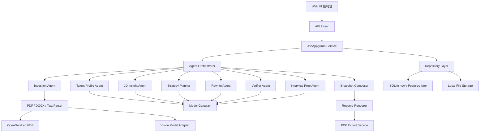
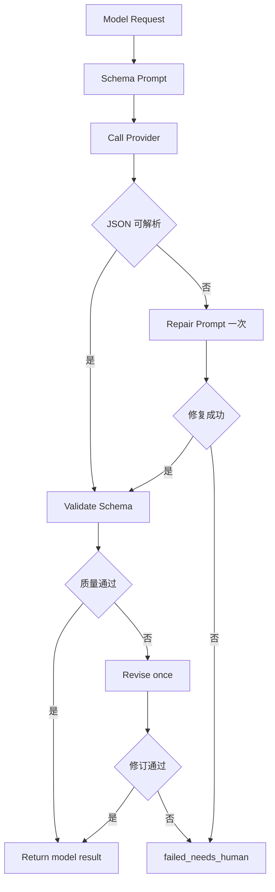

# OfferYou Agent 架构设计 v3.3

## 1. 架构摘要

OfferYou v3.3 采用 Agent-first 架构。系统核心不是页面路由，而是一次可追踪、可暂停、可恢复、可验证的 `JobApplyRun`。Web UI 是人类控制台，Agent Orchestrator 是任务内核，模型网关提供理解与生成能力，工具层负责 PDF 解析、渲染、导出和一致性检查。

架构目标：

- 对齐 `job-apply` Skill 的稳定能力。
- 让 AI 真正负责理解、规划、改写和校验。
- 让代码负责状态、数据边界、工具调用和 PDF 稳定性。
- 让用户在关键风险点确认，而不是承担整条流程的重复劳动。

## 2. 需求摘要

### 2.1 功能需求

- 输入原始简历和 JD。
- 校准简历结构。
- 理解 JD。
- 规划改写策略。
- 生成岗位定制建议。
- 校验事实与岗位匹配。
- 用户逐条确认。
- 合成 FinalResumeDraft。
- 预览并导出 PDF。
- 生成面试准备。
- 写入投递记录。

### 2.2 非功能需求

- 事实可信：所有输出能追溯到原始事实。
- 可恢复：模型失败后保留状态和风险提示。
- 可解释：每条建议显示对应 JD 能力和原始证据。
- 可替换：模型供应商可替换，默认 MiMo OpenAI-compatible。
- 可验证：预览与导出一致，测试覆盖核心链路。
- 本地优先：当前以单用户本地数据为主，保留后续多用户边界。

## 3. 总体架构



## 4. 核心设计决策

### ADR-001：以 JobApplyRun 作为系统主线

**决策**：每一次岗位定制都创建一个 `JobApplyRun`。

**原因**：

- 可以记录 Agent 每一步输入、输出、风险和模型 trace。
- 可以暂停在人工确认点。
- 可以复盘为什么生成这份简历。

**取舍**：

- 增加状态管理复杂度。
- 换来可追踪、可恢复和可验收。

### ADR-002：FinalResumeDraft 是唯一输出源

**决策**：预览、PDF、面试准备都读取 `FinalResumeDraft`。

**原因**：

- 避免「确认建议后预览不同步」。
- 避免「预览是 A 模板，导出是 B 模板」。
- 避免面试准备读取未确认原始解析文本。

**取舍**：

- Snapshot 合成逻辑必须更严格。
- 所有模块必须绑定统一草稿。

### ADR-003：模型失败时停止，而不是伪装成功

**决策**：真实模型不可用时，不允许静默使用规则兜底生成可投递简历。

**原因**：

- OfferYou 的核心价值是 AI 定制能力。
- 规则兜底只能用于开发、排查和失败恢复。

**取舍**：

- 用户可能看到失败提示。
- 但避免输出低质量内容误导投递。

### ADR-004：模板冻结

**决策**：Professional CN 和 ATS Clean 当前视觉冻结。

**原因**：

- 最近大量时间消耗在模板细节，偏离 AI 主链路。
- 现有模板已达到基本可投递标准。

**取舍**：

- 暂时不追求更多视觉变化。
- 优先解决内容质量、模型链路和一致性。

### ADR-005：TalentProfile 是最大能力模式的必要上下文

**决策**：OfferYou 支持基础岗位定制，但产品的最大能力模式必须读取 `TalentProfile`。

**原因**：

- 只根据 JD 改写，容易退化成普通关键词优化工具。
- `job-apply` Skill 的优势来自模型在完整上下文中的判断能力。
- 天赋挖掘提供用户底层优势、能量来源、可迁移能力和表达边界。
- 简历优化的目标不是迎合 JD，而是找到「用户真实优势」与「岗位机会」的交叉表达。

**取舍**：

- 未完成天赋挖掘时，仍允许基础岗位定制和手动编辑。
- 完成天赋挖掘后，才标记为天赋驱动 Agent 模式。

### ADR-006：AI 与代码按节点分工

**决策**：需要理解、比较、判断、改写、取舍的节点由 AI 主导；需要保存、状态、导出、安全、格式和一致性的节点由代码主导。

**原因**：

- 规则兜底不能替代模型能力。
- 模型不应参与确定性状态修改。
- 明确边界可以避免后续实现再次跑偏。

**参考**：[[OfferYou-AI与代码职责边界-v3.3]]

## 5. Agent 分工

### 5.1 Ingestion Agent

职责：

- 接收 PDF、DOCX、TXT 或纯文本。
- 调用 OpenDataLab PDF 解析。
- 在需要时调用视觉模型做布局校准。
- 输出原始文本、结构候选和解析风险。

输出：

```ts
type IngestionResult = {
  rawText: string;
  sourceAssets: SourceAsset[];
  parseWarnings: string[];
  needsVisionReview: boolean;
};
```

### 5.2 Resume Calibration Agent

职责：

- 将解析结果校准为 `CalibratedResumeProfile`。
- 识别个人信息、个人优势、工作经历、项目经历、教育背景。
- 标记低置信模块。
- 识别疑似 OCR 错误。

输出：

```ts
type CalibratedResumeProfile = {
  profileId: string;
  personalInfo: PersonalInfoBlock;
  sections: CalibratedResumeSection[];
  issues: CalibrationIssue[];
  confidence: "low" | "medium" | "high";
};
```

### 5.2.1 Talent Profile Agent

职责：

- 承接深度天赋挖掘流程。
- 生成用户长期 `TalentProfile`。
- 把核心优势、可迁移能力、能量来源、风险盲区写入 Master Insight。
- 为岗位定制提供用户模型。

输出：

```ts
type TalentProfile = {
  profileId: string;
  strengths: string[];
  transferableAbilities: string[];
  energyPatterns: string[];
  evidenceSignals: string[];
  expressionGuidance: string[];
  riskBoundaries: string[];
};
```

运行规则：

- 该节点必须使用模型。
- 模型不可用时，不生成伪天赋画像。
- 未完成该节点时，岗位定制只能标记为基础岗位定制模式。

### 5.3 JD Insight Agent

职责：

- 理解 JD，而不是只提取关键词。
- 输出公司、岗位、硬要求、核心能力、加分项、风险。
- 给后续改写提供能力标签。

输出：

```ts
type JDInsight = {
  company: string;
  jobTitle: string;
  hardRequirements: string[];
  coreAbilities: JDAbility[];
  bonusSignals: string[];
  avoidSignals: string[];
  riskNotes: string[];
};
```

### 5.4 Strategy Planner

职责：

- 根据 JDInsight、CalibratedResumeProfile 和 TalentProfile 制定改写策略。
- 判断哪些经历重点写、哪些经历压缩、哪些只保留时间线。
- 决定个人优势的表达方向。

输出：

```ts
type RewriteStrategy = {
  prioritySectionIds: string[];
  compressSectionIds: string[];
  keepTimelineOnlyIds: string[];
  summaryFocus: string[];
  sectionGuidance: Record<string, string>;
};
```

### 5.5 Rewrite Agent

职责：

- 生成 T 型建议。
- 每条建议绑定原始事实和 JD 能力。
- 对弱相关经历减少阐述，只保留时间线和迁移能力。
- 不编造事实。

输出：

```ts
type RewriteSuggestion = {
  id: string;
  candidateId: string;
  sectionType: ResumeSectionType;
  beforeText: string;
  afterText: string;
  jdAbility: string;
  reason: string;
  factAnchors: string[];
  riskNotes: string[];
  status: "pending" | "accepted" | "rejected" | "edited";
  revisionRound: number;
};
```

### 5.6 Verifier Agent

职责：

- 校验 AI 输出是否可信。
- 检查事实来源、JD 对齐、模块归属、重复内容、教育背景、公司名称、时间。
- 发现问题时允许一次模型修订。
- 二次失败进入人工确认。

输出：

```ts
type RewriteVerification = {
  status: "pass" | "warn" | "fail";
  issues: VerificationIssue[];
  revisedSuggestion?: RewriteSuggestion;
};
```

### 5.7 Snapshot Composer

职责：

- 只读取已确认内容生成 FinalResumeDraft。
- 保证预览、PDF 和面试准备共享同一份数据。
- 去掉补充信息模块，英语等级放入个人信息。
- 空字段不显示。

输出：

```ts
type FinalResumeDraft = {
  draftId: string;
  templateKey: "professional-cn" | "ats-clean";
  personalInfo: PersonalInfoBlock;
  summary: ResumeBlock[];
  workExperience: ResumeExperience[];
  projects: ResumeProject[];
  education: ResumeEducation[];
  createdFromSuggestionIds: string[];
};
```

### 5.8 Interview Prep Agent

职责：

- 基于 FinalResumeDraft 和 JDInsight 生成面试准备。
- 输出问题、追问、自我介绍、STAR 回答骨架。

输出：

```ts
type InterviewPrep = {
  applicationId: string;
  questions: InterviewQuestion[];
  selfIntro: string;
  followUpRisks: string[];
  reverseQuestions: string[];
};
```

## 6. 模型网关

### 6.1 默认模型

默认模型为 MiMo OpenAI-compatible。

环境变量：

- `MIMO_API_KEY`
- `MIMO_BASE_URL`
- `MIMO_MODEL`

保留可选供应商：

- Gemini。
- DeepSeek。
- OpenAI-compatible 其他模型。

### 6.2 调用策略



### 6.3 Provider Trace

每次模型调用记录：

- provider。
- model。
- latencyMs。
- generationMode。
- fallbackReason。
- riskNotes。

这些信息用于调试，不直接暴露在页面正文中。

## 7. 数据分层

### 7.1 Source Layer

保存原始输入：

- 原始简历文件。
- 原始 JD。
- OCR / 解析文本。
- 截图或附件。

### 7.2 Calibration Layer

保存校准后的事实结构：

- 个人信息。
- 个人优势。
- 工作经历。
- 项目经历。
- 教育背景。
- 置信度和问题。

### 7.3 Strategy Layer

保存 JD 理解和改写策略：

- JDInsight。
- RewriteStrategy。
- 匹配度。
- 风险项。

### 7.4 Review Layer

保存用户确认过程：

- 建议状态。
- 手动编辑。
- AI 微调记录。
- 接受和拒绝。

### 7.5 Output Layer

保存最终结果：

- FinalResumeDraft。
- ResumeSnapshot。
- PDF 文件。
- InterviewPrep。
- ApplicationRecord。

## 8. API 设计

### 8.1 Agent Run

```http
POST /api/applications/:id/agent/run
GET /api/applications/:id/agent/status
```

用途：

- 启动或继续岗位定制。
- 查询当前阶段。
- 返回下一步需要用户确认的内容。

### 8.2 结构确认

```http
POST /api/applications/:id/calibration/confirm
```

用途：

- 保存个人信息修正。
- 确认低置信模块。
- 标记疑似 OCR 错误。

### 8.3 建议操作

```http
POST /api/applications/:id/suggestions/:suggestionId/action
```

动作：

- accept。
- reject。
- edit。
- refine。

### 8.4 Snapshot 与导出

```http
POST /api/applications/:id/snapshot
POST /api/applications/:id/export
```

要求：

- Snapshot 只读取已确认内容。
- Export 使用 Snapshot 的 `templateKey`。

## 9. UI 架构

### 9.1 顶部工作台

显示：

- 公司和岗位。
- 匹配度。
- 优势对应 JD 能力的简短说明。
- 同步预览按钮。

### 9.2 个人信息

展示原简历识别到的信息：

- 姓名。
- 手机。
- 邮箱。
- 学历。
- 居住地。
- GitHub。
- 作品集。
- 英语等级。

规则：

- 有内容才显示到简历。
- 用户可编辑。
- 不强制填写。

### 9.3 建议确认区

按简历结构分组：

- 个人优势。
- 工作经历。
- 项目经历。
- 教育背景。

每组包含若干子项。

子项采用 T 型结构：

- 左侧：原简历中的相关证据。
- 右侧：AI 优化改写。
- 右上：对应 JD 能力。
- 底部：接受、编辑、拒绝、AI 微调。

交互：

- 点击按钮后状态颜色变化。
- 一个大模块内全部子项确认后自动收起。
- 自动展开下一个未完成模块。
- 重新展开已完成模块后再次确认，也应自动收起。

### 9.4 预览与导出

- 预览读取 FinalResumeDraft。
- 导出读取同一份 FinalResumeDraft。
- 当前模板选择必须传递到导出服务。

## 10. 质量门槛

### 10.1 与 `job-apply` 对齐

每个真实样本都需要和 `job-apply` 输出人工对照：

- 简历结构是否完整。
- 改写是否针对 JD。
- 是否保持事实可信。
- PDF 是否可投递。
- 面试准备是否继承岗位上下文。

### 10.2 自动测试

必须覆盖：

- 模型缺失时停止并提示。
- JSON repair。
- revisionRound 不产生 `NaN`。
- JSON.parse 安全读取。
- Suggestion action 不崩溃。
- Snapshot 与 PDF 内容一致。
- 当前模板选择正确导出。

### 10.3 人工验收

至少保留 3 组真实样本：

- AIPM。
- AI 应用 / 内容运营。
- 弱相关转岗。

每组产物：

- Agent Run 报告。
- 建议清单。
- FinalResumeDraft。
- PDF。
- 面试准备。
- 与 `job-apply` 的人工对照结论。

## 11. 风险与缓解

| 风险 | 影响 | 缓解 |
|---|---|---|
| 模型输出不稳定 | 建议质量波动 | Schema、repair、Verifier、真实样本评测 |
| PDF 解析错位 | 模块内容错放 | Calibration Layer 和人工确认 |
| 规则兜底冒充 AI | 产品价值失真 | 页面明确标识，正式生成停止 |
| 模板反复调整 | 偏离主线 | 模板冻结规则 |
| JSON Blob 损坏 | 页面 500 | 安全 parse 和错误边界 |
| 并发覆盖 | 数据丢失 | 单用户阶段提示，后续引入版本号 |
| API Key 泄露 | 安全风险 | `.env.local` 不入库，提交前 grep |

## 12. 后续实施顺序

### 批次 1：契约与状态

- 完成 `JobApplyRun` 状态持久化。
- 完成 `AgentStepResult`。
- 补 run-state 单测。

### 批次 2：模型主路径

- MiMo OpenAI-compatible 作为默认主路径。
- JSON repair。
- 失败停止，不静默兜底。

### 批次 3：结构校准

- `CalibratedResumeProfile` 成为建议生成唯一事实来源。
- 低置信项进入人工确认。

### 批次 4：JDInsight 与策略

- 能力标签来自真实 JD。
- 弱相关经历压缩。
- 强相关经历重点表达。

### 批次 5：Rewrite + Verifier

- 建议绑定 candidateId。
- 校验事实、模块归属、重复、学历和公司名。

### 批次 6：Snapshot 合成

- FinalResumeDraft 统一预览、导出和面试准备。
- 清理补充信息模块。

### 批次 7：UI 绑定 Agent 状态

- 顶部工作台。
- T 型确认。
- 自动收起。
- 同步预览。

### 批次 8：面试准备

- 基于 FinalResumeDraft 和 JDInsight。
- 输出问题、自我介绍和 STAR 骨架。

### 批次 9：真实样本评测

- 与 `job-apply` 输出对齐。
- 生成评测报告。

## 13. 当前架构结论

OfferYou v3.3 的架构不是「Next.js 页面 + 若干 AI API」，而是：

> `JobApplyRun` 驱动的求职 Agent 系统，Web UI 只是可控工作台，FinalResumeDraft 是所有输出的唯一来源。

这条边界一旦守住，后续才能从简历工具自然扩展到职业陪伴产品。
