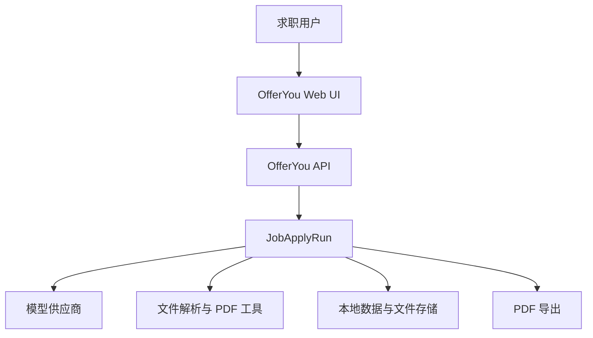
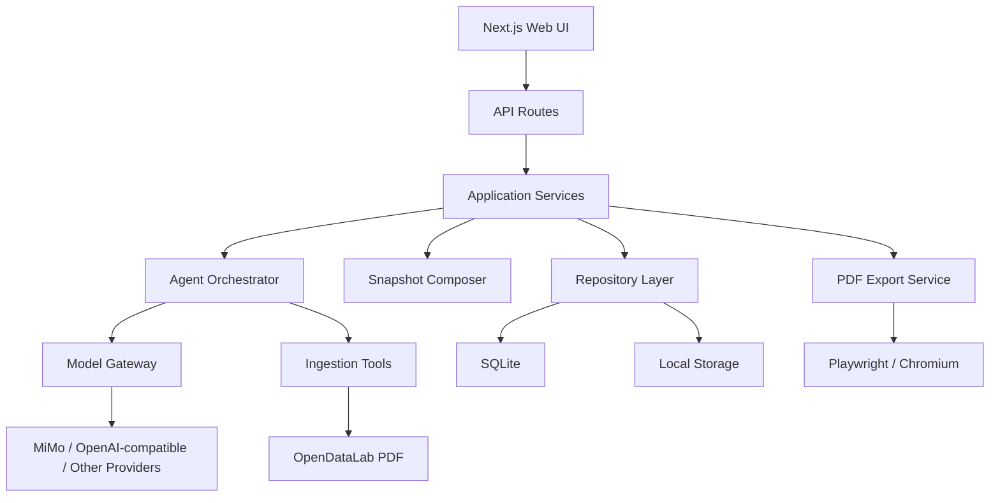
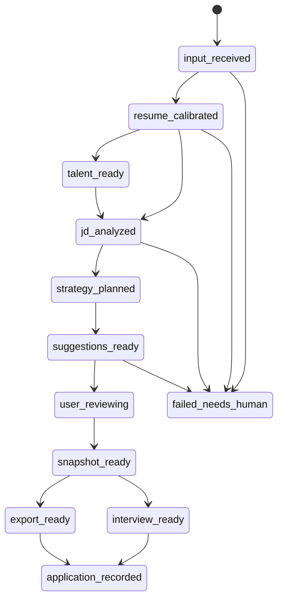

# OfferYou Architecture

## 1. 文档定位

本文是 OfferYou 的架构主文档。它定义系统分层、Agent 流程、数据模型、AI 与代码职责边界、质量门禁和工程约束。

后续实现计划可以改变具体文件、接口和技术细节，但不得违背本文的核心架构原则。若架构方向发生变化，应先更新本文，再制定执行计划。

## 2. 架构目标

OfferYou 采用 Agent-first 架构。系统核心不是页面路由，而是一次可追踪、可暂停、可恢复、可验证的 `JobApplyRun`。

架构目标：

- 对齐 `job-apply` Skill 的稳定能力。
- 让 AI 负责理解、规划、改写和校验。
- 让代码负责状态、数据边界、工具调用和 PDF 稳定性。
- 让用户在关键风险点确认。
- 保证预览、PDF 和面试准备读取同一份最终草稿。

## 3. 系统上下文



## 4. 容器架构



## 5. 核心组件

| 组件 | 职责 |
|---|---|
| Web UI | 输入、确认、编辑、预览、导出 |
| API Layer | 接收请求、调用服务、返回用户可读状态 |
| JobApplyRun Service | 管理一次岗位定制任务的状态 |
| Agent Orchestrator | 编排校准、JD 理解、策略、改写、校验、面试准备 |
| Model Gateway | 统一模型调用、JSON 修复、trace 与风险记录 |
| Ingestion Tools | PDF、DOCX、TXT、OCR 和多模态校准接入 |
| Snapshot Composer | 合成 FinalResumeDraft |
| Resume Renderer | 渲染 Professional CN 和 ATS Clean |
| PDF Export Service | 生成 PDF 并保证与预览主体一致 |
| Repository Layer | 数据读写、JSON 安全解析、版本记录 |

## 6. Agent Run 状态机



## 7. Agent 分工

### 7.1 Ingestion Agent

接收 PDF、DOCX、TXT 或纯文本，调用 OpenDataLab PDF 和其他解析工具，输出原始文本、布局线索和解析风险。

### 7.2 Resume Calibration Agent

将解析结果校准为 `CalibratedResumeProfile`，识别个人信息、个人优势、工作经历、项目经历和教育背景。低置信模块进入人工确认。

### 7.3 Talent Profile Agent

承接天赋挖掘流程，生成长期 `TalentProfile`，为岗位定制提供用户模型。

### 7.4 JD Insight Agent

理解 JD，输出公司、岗位、硬要求、核心能力、加分项、风险项和岗位关键词。

### 7.5 Strategy Planner

根据 `JDInsight`、`CalibratedResumeProfile` 和 `TalentProfile` 制定改写策略，决定重点强化、弱相关压缩和只保留时间线的内容。

### 7.6 Rewrite Agent

生成 T 型建议。每条建议绑定原始事实、JD 能力和 `candidateId`，不得编造事实。

### 7.7 Verifier Agent

校验事实来源、JD 对齐、模块归属、重复内容、教育背景、公司名称、时间和页数风险。

### 7.8 Snapshot Composer

只读取已确认内容生成 `FinalResumeDraft`。预览、PDF 和面试准备必须共享这一份数据。

### 7.9 Interview Prep Agent

基于 `FinalResumeDraft` 和 `JDInsight` 生成面试问题、自我介绍、追问方向、风险回答和反问问题。

## 8. AI 与代码职责边界

### 8.1 必须 AI 的节点

以下节点不能用确定性规则替代，也不能用规则兜底冒充 AI：

- 天赋挖掘与 `TalentProfile` 生成。
- JD 理解。
- 简历结构校准中的模块归属判断。
- 视觉布局校准。
- 匹配度与差距分析中的能力判断。
- 改写策略。
- 简历改写。
- 事实可信度的语义判断。
- 面试准备。
- 职业方向建议。

模型不可用时，页面只能进入基础编辑、人工确认或规则参考状态，不能继续生成看似完整的 AI 结果。

### 8.2 应由代码完成的节点

以下节点不应交给模型主导：

- 文件上传、MIME / 扩展名校验、大小限制。
- 文件存储、哈希、版本管理。
- OpenDataLab PDF、DOCX、TXT 等工具调用。
- 数据库读写、JSON 安全解析、事务和并发保护。
- `JobApplyRun` 状态机。
- 建议接受、拒绝、编辑、微调的状态切换。
- `FinalResumeDraft` 合成。
- 模板渲染、分页、PDF 导出。
- 空字段隐藏。
- 预览与导出一致性检查。
- API Key 安全、日志脱敏。
- 测试、质量报告和 Git 同步。

## 9. 数据分层

| 层 | 内容 | 规则 |
|---|---|---|
| Source Layer | 原始简历、JD、截图、解析文本 | 保留原始输入，不直接投喂成品 |
| Calibration Layer | 校准后的事实结构 | 作为建议和快照的事实来源 |
| Talent Layer | `TalentProfile` 和 Master Insight | 长期用户模型，需用户确认 |
| Strategy Layer | `JDInsight`、匹配度、改写策略 | 模型主导，记录 trace |
| Review Layer | 建议状态、人工编辑、AI 微调 | 所有进入成品的表达必须确认 |
| Output Layer | `FinalResumeDraft`、PDF、面试准备、投递记录 | 预览、PDF、面试准备共享同一来源 |

## 10. 核心数据对象

```ts
type JobApplyRun = {
  id: string;
  applicationId: string;
  status: JobApplyRunStatus;
  currentStep: string;
  riskNotes: string[];
  providerTraces: ModelProviderTrace[];
};
```

```ts
type CalibratedResumeProfile = {
  profileId: string;
  personalInfo: PersonalInfoBlock;
  sections: CalibratedResumeSection[];
  issues: CalibrationIssue[];
  confidence: "low" | "medium" | "high";
};
```

```ts
type RewriteSuggestion = {
  id: string;
  candidateId: string;
  sectionType: ResumeSectionType;
  beforeText: string;
  afterText: string;
  jdAbility: string;
  reason: string;
  factAnchors: string[];
  riskNotes: string[];
  status: "pending" | "accepted" | "rejected" | "edited";
  revisionRound: number;
};
```

```ts
type FinalResumeDraft = {
  draftId: string;
  templateKey: "professional-cn" | "ats-clean";
  personalInfo: PersonalInfoBlock;
  summary: ResumeBlock[];
  workExperience: ResumeExperience[];
  projects: ResumeProject[];
  education: ResumeEducation[];
  createdFromSuggestionIds: string[];
};
```

## 11. 模型策略

### 11.1 模型模式

| 模式 | 用途 |
|---|---|
| 基础编辑模式 | 模型不可用时的手动编辑、模板预览和 PDF 导出 |
| 标准 AI 模式 | 常规 JD 理解、改写、校验和面试准备 |
| 高质量 AI 模式 | JD 截图、多模态校准、复杂转岗、最终投递前复核 |

### 11.2 模型调用规则

- 默认使用 OpenAI-compatible 网关。
- 模型调用必须记录 provider、model、latency、generationMode、fallbackReason 和 riskNotes。
- JSON 解析失败时允许一次 repair。
- repair 失败后进入 `failed_needs_human`，不能伪装成功。
- 规则兜底输出不得标记为 AI 改写。

## 12. 质量门禁

### 12.1 事实门禁

- JD 文本不能作为候选人事实依据。
- 公司名、学校、学历、时间和数字必须能追溯到简历事实或用户确认。
- `verification.status === "fail"` 时，普通接受按钮不可用。

### 12.2 模块门禁

- 简历结构校准阶段只允许固定枚举：`summary`、`work`、`project`、`education`、`credential`、`personal_info`、`other_needs_review`。
- 改写建议不能改变原候选块的 section。
- `other_needs_review` 不准默认进入工作经历或项目经历。
- 独立补充信息模块不进入最终简历；相关内容进入个人信息或个人优势。

### 12.3 输出门禁

- `FinalResumeDraft` 是预览、PDF 和面试准备的唯一来源。
- 当前选择 ATS Clean 时，导出必须是 ATS Clean。
- Professional CN 和 ATS Clean 模板视觉冻结。
- PDF 一页优先，最多两页。

## 13. API 概览

```http
POST /api/applications/:id/agent/run
GET /api/applications/:id/agent/status
POST /api/applications/:id/calibration/confirm
POST /api/applications/:id/suggestions/:suggestionId/action
POST /api/applications/:id/snapshot
POST /api/applications/:id/export
```

## 14. 测试策略

核心验证命令：

```bash
pnpm exec tsc --noEmit
pnpm test
pnpm run test:pdf
pnpm run check:vnext
```

必须保留的测试方向：

- 上传文件类型校验。
- JSON 安全解析。
- 模型不可用时的可见提示。
- JD 理解与能力标签。
- 简历结构校准。
- 改写建议绑定 `candidateId`。
- Verifier 事实校验。
- Snapshot / PDF 内容一致性。
- 模板选择导出一致性。

## 15. 架构决策记录

长期架构决策记录放在 `docs/product/decisions/`。当出现以下变化时，必须新增或更新 ADR：

- Agent Run 主线变化。
- 数据分层变化。
- 模型失败策略变化。
- 模板冻结规则变化。
- AI 与代码职责边界变化。
- PDF / Snapshot 输出源变化。

## 16. 历史依据

本文整合以下历史文档：

- `docs/product/archive/OfferYou-Agent架构设计-v3.3.md`
- `docs/product/archive/OfferYou-AI与代码职责边界-v3.3.md`
- `design/docs/MVP_Protocol.md`
- `docs/plans/2026-03-17-v2-productized-mvp-design.md`
