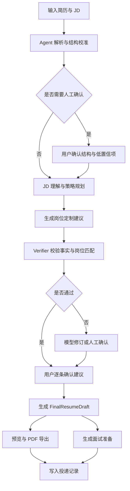

# OfferYou PRD v3.3 Agent-first

## 1. 摘要

OfferYou v3.3 是一个 Agent-first 岗位定制求职工作台，目标是把 `job-apply` Skill 的稳定能力产品化。产品不再以页面功能数量为中心，而是以一次完整的岗位定制 Agent Run 为中心：从原始简历和 JD 出发，生成事实可信、岗位匹配、可导出 PDF 的简历快照，并自动延伸面试准备。

本阶段优先级为 A → C → B：

- A：全面发挥 AI 能力，10 分钟内产出可投递简历和面试准备。
- C：功能质量先对齐 `job-apply` Skill。
- B：后续扩展为长期职业陪伴产品。

## 2. 联系人与角色

| 角色 | 负责人 | 说明 |
|---|---|---|
| 产品负责人 | 吴世阳 | 第一用户、需求提出者、真实求职验收者 |
| Agent 产品设计 | Codex / 后续 Agent | 负责 PRD、Agent 流程、验收标准与执行计划 |
| 工程实现 | Codex / Antigravity / 后续低模型 Agent | 负责按计划实现、验证和同步 |
| 质量验收 | 吴世阳 | 以真实简历、真实 JD、真实 PDF 投递标准验收 |

## 3. 背景

OfferYou 的起点不是一个泛化求职 SaaS，而是一个真实自用痛点：针对不同岗位反复打开 AI 网页端，复制简历、复制 JD、让模型改写，再手动整理排版和导出 PDF。早期 Web demo 证明了交互方向可行，但也暴露出核心问题：页面看起来像产品，实际 AI 能力和最终简历质量却不如直接使用强模型或 `job-apply` Skill。

`job-apply` Skill 带来的关键启发是：好结果不是来自更多页面，而是来自清晰的 Agent 工作流。它把流程压缩为「差距分析 → 建议清单 → 人工确认 → 简历快照 → PDF 导出 → 面试准备」，并通过模型能力完成理解、改写和面试准备。

因此，OfferYou v3.3 的重构方向是：

- Agent 负责理解、规划、改写、校验和生成。
- Web UI 负责输入、确认、编辑、预览、导出和留档。
- 代码负责流程状态、工具调用、数据边界、版本快照和 PDF 稳定性。

## 4. 目标

### 4.1 产品目标

第一阶段目标是在单用户真实求职场景中，让一次岗位定制达到以下结果：

- 从上传简历和 JD 到生成可投递 PDF，目标用时小于 10 分钟。
- 简历内容针对目标岗位，不只是原文重排或关键词替换。
- 每条改写都能追溯到原始事实，不能编造公司、学历、时间和结果。
- 预览简历和导出 PDF 使用同一份最终草稿。
- 面试准备基于最终岗位快照，而不是基于原始简历或兜底规则。

### 4.2 关键结果

| 指标 | 目标 |
|---|---|
| 首次岗位定制完成时间 | 小于 10 分钟 |
| PDF 可投递率 | 人工验收达到「可直接投递」 |
| 与 `job-apply` Skill 的质量差距 | 不明显低于 Skill 输出 |
| 事实错误 | P0 错误为 0，包括公司名、学历、时间、项目归属错误 |
| 预览与导出一致性 | 主体内容一致 |
| 模型兜底透明度 | 模型失败时页面明确提示，不能伪装成 AI 改写 |

## 5. 用户与场景

### 5.1 第一用户

第一用户是当前项目作者本人。核心场景是真实求职，同时把 OfferYou 作为 AI 产品经理转型作品集的一部分。AIPM 是产品产生的背景和作品集叙事，不作为产品首页定位。

### 5.2 后续用户

后续用户是相似求职者：

- 有基础简历，但需要频繁针对不同岗位改写。
- 会使用 AI，但不想反复复制粘贴和重建上下文。
- 重视真实性，不希望 AI 编造经历。
- 需要稳定 PDF 和面试准备。
- 希望长期积累个人职业资料，而不是每次从零开始。

### 5.3 核心场景

#### 场景 A：快速岗位定制

用户拿到一个 JD，希望快速判断是否值得投递，并生成一版可投递简历。

#### 场景 B：Skill 级别简历优化

用户希望 Web 端输出效果至少接近 `job-apply` Skill，包括改写质量、PDF 稳定性和面试准备。

#### 场景 C：面试前准备

用户收到面试通知，希望基于当时投递的简历快照生成问题预测、自我介绍和 STAR 回答骨架。

#### 场景 D：长期职业陪伴

用户经过多次投递和面试后，希望系统逐步总结个人优势、适合方向和证据资产。

## 6. 产品原则

### 6.1 Agent first

产品主线不是页面流程，而是一次可追踪的 `JobApplyRun`。页面只展示 Agent 的状态、证据、建议、风险和确认点。

### 6.1.1 天赋画像是最大能力模式的核心上下文

OfferYou 的最大能力不是单纯「根据 JD 改简历」，而是把用户真实优势、可迁移能力、原始简历事实和目标 JD 放在同一个 Agent 上下文中判断。天赋挖掘生成的 `TalentProfile` 是 User Model Builder，不是可选装饰功能。

未完成天赋挖掘时，系统可以进入基础岗位定制模式；完成天赋挖掘后，系统才进入天赋驱动 Agent 模式。后者才代表 OfferYou 的完整产品能力。

### 6.2 Skill parity

`job-apply` Skill 是最低质量基线。Web 端允许交互更友好，但不允许输出质量明显低于 Skill。

### 6.3 AI 最大化

AI 应用于需要理解和判断的环节：

- 天赋挖掘与 TalentProfile 生成。
- 简历结构校准。
- JD 深度理解。
- 岗位匹配策略。
- 简历改写。
- 事实校验。
- 面试准备。
- 职业优势提炼。

代码只处理确定性流程、状态、导出和一致性检查，不能用规则兜底伪装成 AI 能力。

具体节点边界以 [[OfferYou-AI与代码职责边界-v3.3]] 为准。任何后续 Agent 修改主链路前，必须先确认该节点属于 AI 主责、代码主责还是混合节点。

### 6.4 事实不污染

原始简历、校准简历、岗位草稿、最终快照分层保存。接受建议只写入当前岗位草稿和 Snapshot，不回写 Master。

### 6.5 人在关键点确认

Agent 自动完成链路，但在关键风险点停下：

- 简历结构低置信。
- 新事实或疑似 OCR 错误。
- 改写建议采纳。
- 最终 PDF 导出。

### 6.6 模板冻结

Professional CN 和 ATS Clean 当前模板冻结。除非明确要求，不再调整视觉风格，只允许修复以下问题：

- 预览与导出不一致。
- 溢出、重复、缺失。
- 模块错位。
- 一页或两页控制失败。

## 7. 价值主张

### 7.1 对第一用户

- 少复制粘贴，减少重复劳动。
- 快速得到可投递简历。
- 用真实项目展示 AI 产品经理能力。
- 把求职过程沉淀成可复用资产。

### 7.2 对相似求职者

- 不再每次从零向 AI 解释背景。
- 不再被普通简历优化工具局限在关键词修改。
- 能看到为什么这样改、风险在哪里、是否值得投。
- 面试准备继承同一份岗位上下文。

### 7.3 与普通 AI 简历工具的差异

| 普通工具 | OfferYou v3.3 |
|---|---|
| 一次性改写 | Agent Run 全链路 |
| 关键词优化 | JD 理解 + 事实证据 + 策略改写 |
| 输出不可追溯 | 每条建议绑定原始事实 |
| PDF 只是附属 | PDF 是核心验收产物 |
| 简历和面试割裂 | 面试准备基于最终快照 |

## 8. 解决方案

### 8.1 用户流程

### 8.2 核心功能

#### 8.2.1 输入与解析

- 支持 PDF、DOCX、TXT、纯文本。
- PDF 解析优先走 OpenDataLab PDF。
- 多模态模型作为增强能力，用于识别布局和纠正解析错误。
- 解析结果不能直接生成建议，必须先进入结构校准。

#### 8.2.2 简历结构校准

将原始解析文本转换为 `CalibratedResumeProfile`：

- 个人信息。
- 个人优势。
- 工作经历。
- 项目经历。
- 教育背景。
- 可选补充信息。

每个模块记录：

- 原始文本。
- 结构类型。
- 置信度。
- 来源位置。
- 风险提示。
- 是否需要人工确认。

#### 8.2.3 JD 理解

模型需要输出：

- 公司名称。
- 岗位名称。
- 硬性要求。
- 核心能力。
- 加分项。
- 风险项。
- 优先改写顺序。

能力标签必须来自 JD 真实内容，不允许出现「目标岗位要求的动作」这类空泛标签。

#### 8.2.4 改写建议

每条建议必须包含：

- 原始事实。
- AI 优化改写。
- 对应 JD 能力。
- 改写理由。
- 事实锚点。
- 风险提示。
- 状态：待处理、已接受、已拒绝、待微调。

页面展示采用 T 型结构：

- 左侧：原简历中的相关证据。
- 右侧：AI 针对 JD 和个人优势改写后的内容。
- 按钮：接受、编辑、拒绝、AI 微调。
- 一个大模块内所有子项确认后，自动收起并进入下一模块。

#### 8.2.5 FinalResumeDraft

FinalResumeDraft 是预览、PDF、面试准备的唯一来源。它只能由以下内容合成：

- 已确认的结构校准结果。
- 已接受或手动编辑的建议。
- 用户补充的个人信息。
- 明确保留的教育背景。

#### 8.2.6 PDF 导出

- Professional CN 和 ATS Clean 两套模板保留。
- 用户当前选择哪个模板，导出必须使用同一模板。
- 一页优先，最多两页。
- 预览与导出主体内容一致。
- 不放照片。
- GitHub、作品集、居住地等字段为空时不显示。

#### 8.2.7 面试准备

面试准备必须基于 JDInsight 和 FinalResumeDraft 生成：

- 高频问题。
- 追问方向。
- STAR 回答骨架。
- 自我介绍。
- 反问问题。

不得直接基于原始解析文本生成。

## 9. MVP 范围

### 9.1 包含

- 简历上传与文本输入。
- JD 文本输入与截图 OCR / 图片解析预留。
- 结构校准。
- JD 理解。
- Agent 策略规划。
- 岗位定制建议。
- 用户逐条确认。
- FinalResumeDraft。
- 两套冻结模板预览和 PDF 导出。
- 投递记录。
- 基于快照的面试准备。
- 模型供应商配置。
- 模型失败可读提示。

### 9.2 暂不包含

- 社区。
- 批量投递。
- 批量岗位扫描。
- 视频模拟面试。
- 语音模拟面试。
- 简历模板市场。
- 照片功能。
- 公开 SaaS 计费。
- 多用户权限系统。

## 10. 信息架构

### 10.1 顶层入口

- 总览。
- 岗位定制。
- 天赋发现。
- 面试准备。
- 我的资料。
- 事实主档。

### 10.2 岗位定制页结构

顶部：

- 公司和岗位。
- 匹配度。
- 优势对应 JD 能力的简短说明。
- 同步预览按钮。

主体：

- 个人信息。
- 个人优势。
- 工作经历。
- 项目经历。
- 教育背景。

右侧不再保留单独的匹配度和优势分析卡片，空间优先给建议确认与简历优化内容。

## 11. 数据对象

### 11.1 JobApplyRun

一次岗位定制任务的总状态。

状态包括：

- `input_received`
- `resume_calibrated`
- `jd_analyzed`
- `strategy_planned`
- `suggestions_ready`
- `user_reviewing`
- `snapshot_ready`
- `interview_ready`
- `export_ready`
- `failed_needs_human`

### 11.2 CalibratedResumeProfile

结构化后的简历事实层。所有建议、快照和面试准备都必须读取它。

### 11.3 JDInsight

岗位理解结果，包括岗位能力、硬性要求、加分项和风险项。

### 11.4 RewriteSuggestion

用户可确认的最小改写单元，必须绑定原始事实和 JD 能力。

### 11.5 FinalResumeDraft

最终岗位简历草稿，是预览、PDF 和面试准备的唯一来源。

### 11.6 TalentProfile

长期用户优势画像，是天赋驱动 Agent 模式的核心输入。它记录用户的核心优势、能量来源、可迁移能力、被反复认可的能力、潜在盲区和适合的表达策略。岗位定制时，`TalentProfile` 与 `CalibratedResumeProfile`、`JDInsight` 共同决定改写策略。

## 12. 验收标准

### 12.1 功能验收

- 上传真实简历和真实 JD 后，可以完成完整岗位定制链路。
- 接受建议后，预览内容同步更新。
- 导出 PDF 使用当前选中的模板。
- 面试准备基于最终快照生成。
- 空字段不显示在简历里。

### 12.2 AI 质量验收

- 真实模型可用时，建议结果不能静默走规则兜底。
- 改写内容不能与原文高度重复。
- 改写必须体现 JD 具体能力。
- 不能把 A 项目内容写到 B 项目。
- 不能改错公司名、学校、学历和时间。
- 不能编造无法验证的成果。

### 12.3 PDF 验收

- Professional CN 与 ATS Clean 均可导出。
- 导出主体内容与预览一致。
- 一页优先，最多两页。
- 排版不能出现明显溢出、重复、错位。

### 12.4 页面文案验收

页面不显示内部技术术语，例如：

- deterministic fallback。
- schema repair。
- prompt repair。
- provider trace。

模型失败时显示可理解说明，例如：

- 当前模型不可用，已停止生成，请检查模型配置。
- 当前结果来自规则兜底，仅用于排查流程，不建议直接投递。

## 13. 版本规划

### 13.1 v3.3

目标：完成 Agent-first PRD 与架构统一，冻结模板与主链路。

重点：

- JobApplyRun 契约。
- 模型主路径。
- 结构校准。
- JDInsight。
- RewriteSuggestion。
- Verifier。
- FinalResumeDraft。

### 13.2 v3.4

目标：让模型真正驱动建议质量。

重点：

- MiMo / OpenAI-compatible 主路径稳定。
- JSON repair。
- 真实样本评测。
- 与 `job-apply` Skill 人工对照。

### 13.3 v3.5

目标：面试准备和投递记录稳定。

重点：

- 面试问题。
- 自我介绍。
- 追问方向。
- 投递记录。
- 快照版本管理。

### 13.4 v4.0

目标：进入职业陪伴产品。

重点：

- 长期 Talent Profile。
- 职业方向建议。
- 多次投递复盘。
- 可复用故事库。

### 13.5 当前架构修正

在 v3.3 后续修正中，天赋挖掘不再被视为 v4.0 才开始的远期能力。v4.0 可以扩展长期职业陪伴，但 `TalentProfile` 必须提前进入当前 Agent 主线，作为 OfferYou 最大能力模式的必要上下文。

## 14. 明确不做

本阶段不做：

- 因审美偏好继续重做模板。
- 因页面漂亮而牺牲 AI 主链路。
- 因规则兜底看似稳定而替代模型能力。
- 因扩展职业陪伴而推迟简历质量对齐。
- 因加入复杂功能而破坏单用户真实求职效率。

## 15. 当前结论

OfferYou v3.3 的一句话定义：

> OfferYou 是一个 Agent-first 岗位定制求职工作台，先用 AI 最大化完成简历和面试准备，再以 `job-apply` Skill 为质量基线，最终扩展为长期职业陪伴产品。
