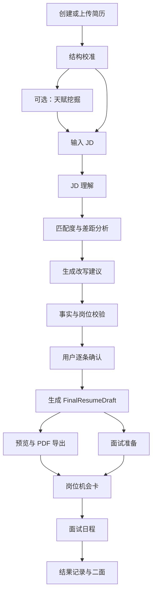

# OfferYou PRD

## 1. 文档定位

本文是 OfferYou 的产品主文档。它定义产品方向、用户价值、功能边界、验收标准和版本策略，是后续设计、开发、验收和 Agent 执行的最高优先级依据。

阶段性文档可以修改实现细节，但不得违背本文的产品原则。若产品方向发生变化，应先更新本文，再制定执行计划。

## 2. 产品定义

OfferYou 是一个基于个人职业画像的 Agent-first AI 求职网站。它通过天赋挖掘、简历事实校准、JD 理解、岗位定制改写、人工确认、简历快照、PDF 导出、面试准备和投递日程，帮助用户把真实经历转化为更适合目标岗位的求职材料，并围绕每一个目标岗位推进完整求职过程。

OfferYou 的 Web UI 是给人类使用的控制台，Agent Run 是产品能力内核。页面负责输入、确认、编辑、预览和导出；AI 负责理解、判断、取舍、改写和准备；代码负责流程状态、事实边界、工具调用、快照和可追溯。

## 3. 产品初心

OfferYou 起源于真实求职痛点：同一份简历面对不同岗位时，需要反复复制简历、复制 JD、打开不同 AI 网页、要求模型改写、手动整理排版和导出 PDF。这个过程耗时、重复、难以追溯，也很容易让模型编造事实或改乱结构。

早期 Web demo 证明了交互方向可行，但也暴露出核心问题：如果只是把网页壳子搭起来，而没有充分发挥大模型的理解和判断能力，最终效果会退化成普通简历美化工具。`job-apply` Skill 证明了另一条路径：先把 Agent 工作流跑通，再把能力产品化。

因此，OfferYou 不追求功能堆叠，而是追求一个清晰目标：在不污染事实的前提下，让用户用更少时间得到一份真正可投递的岗位定制简历，并围绕同一岗位继续完成面试准备、日程提醒、结果记录和二面衔接。

## 4. 第一用户与目标用户

### 4.1 第一用户

第一用户是项目作者本人。核心任务是真实求职，同时把 OfferYou 作为 AI 产品经理转型作品集。AIPM 是产品产生的背景，不作为产品首页定位。

### 4.2 后续用户

后续用户是相似求职者：

- 有基础简历，但需要针对不同岗位频繁修改。
- 会使用 AI，但不想反复复制粘贴和重建上下文。
- 重视真实性，不希望 AI 编造经历。
- 需要稳定 PDF 和面试准备。
- 希望长期沉淀个人职业资料，而不是每次从零开始。

## 5. 产品目标

第一阶段目标是在单用户真实求职场景中，完成一次可验收的岗位定制任务：

- 从上传简历和 JD 到生成可投递 PDF，目标用时小于 10 分钟。
- 简历内容针对目标岗位，不只是原文重排或关键词替换。
- 每条改写都能追溯到原始事实，不能编造公司、学历、时间和结果。
- 预览简历和导出 PDF 使用同一份最终草稿。
- 面试准备基于最终岗位快照，而不是原始 OCR 文本或规则兜底。
- 每一个目标岗位都能形成可追踪的岗位机会卡，串联简历、PDF、面试准备、面试日程和结果记录。

## 6. 成功指标

| 指标 | 目标 |
|---|---|
| 首次岗位定制完成时间 | 小于 10 分钟 |
| PDF 可投递率 | 人工验收达到「可直接投递」 |
| 与 `job-apply` Skill 的质量差距 | 不明显低于 Skill 输出 |
| 事实错误 | P0 错误为 0，包括公司名、学历、时间、项目归属错误 |
| 预览与导出一致性 | 主体内容一致 |
| 模型兜底透明度 | 模型失败时页面明确提示，不能伪装成 AI 改写 |

## 7. 产品原则

### 7.1 Agent first

产品主线不是页面流程，而是一次可追踪、可暂停、可恢复、可验证的 `JobApplyRun`。页面只展示 Agent 的状态、证据、建议、风险和确认点。

### 7.2 Skill parity

`job-apply` Skill 是最低质量基线。Web 端可以提供更好的确认、编辑和留档体验，但输出质量不能明显低于 Skill。

### 7.3 AI 最大化

AI 应用于需要理解和判断的环节：天赋挖掘、简历结构校准、JD 理解、匹配度判断、改写策略、简历改写、事实语义校验、面试准备和职业方向建议。

代码只处理确定性流程、状态、导出和一致性检查。规则兜底只能用于基础编辑、开发排查和失败恢复，不能伪装成 AI 能力。

### 7.4 天赋画像优先

天赋挖掘不是可选装饰功能，而是 OfferYou 最大能力模式的核心上下文。它不是高频点击入口，而是长期职业画像引擎。用户通常只需要深度完成一次，后续偶尔补充，但它必须持续影响简历改写、JD 适配、职业规划、面试准备和自我介绍。

界面上不应把天赋挖掘做成每天都要求用户进入的孤立功能，而应在各处体现其作用：

- 岗位定制中显示「已使用职业画像」和被调用的核心优势。
- 简历建议中说明该建议对应的个人优势或可迁移能力。
- 职业规划中引用 `TalentProfile` 判断岗位方向。
- 面试准备中基于用户优势生成自我介绍和回答策略。

岗位定制时，Agent 同时读取：

- `CalibratedResumeProfile`：事实证据。
- `JDInsight`：岗位机会。
- `TalentProfile`：用户优势、可迁移能力和表达策略。

只有三者同时存在时，OfferYou 才能输出更适合用户、也更能发挥个人潜力的简历。

### 7.5 岗位机会生命周期

OfferYou 的高频主线不是孤立的简历编辑，而是一个目标岗位从发现到复盘的全过程。每个岗位都应形成一张岗位机会卡，承载以下内容：

- 公司、岗位、JD 来源和状态。
- 当前岗位快照和 PDF。
- 匹配度、优势说明和风险。
- 面试准备材料。
- 面试日程、一面、二面和结果。
- 下一步动作，例如继续改简历、准备面试、添加面试时间、记录结果。

### 7.6 事实不污染

原始输入、校准事实、岗位草稿和最终快照分层保存。接受建议只写入当前岗位草稿和 Snapshot，不回写 Master。

### 7.7 人在关键点确认

Agent 可以自动完成理解和生成，但在关键风险点必须停下：

- 简历结构低置信。
- 新事实或疑似 OCR 错误。
- 改写建议采纳。
- 最终 PDF 导出。
- 面试结果和二面时间记录。

### 7.8 模板冻结

Professional CN 和 ATS Clean 是当前冻结模板。除非明确要求，不再调整视觉风格，只允许修复以下问题：

- 预览与导出不一致。
- 溢出、重复、缺失。
- 模块错位。
- 一页或两页控制失败。

## 8. 四大核心功能

### 8.1 简历创建

提供基础简历创建能力，允许用户从零输入个人信息、教育背景、工作经历、项目经历和个人优势。

模型不可用时，系统仍可作为基础简历编辑工具使用，但页面必须明确处于「基础编辑模式」，不能声称已经完成 AI 定制。

### 8.2 已有简历 AI 润色

用户上传已有简历后，系统先解析和校准结构，再基于原始事实进行局部润色。该功能适合没有明确 JD、但希望把表达改得更清楚的场景。

AI 润色必须遵守事实边界：不新增未经确认的公司、学历、时间、指标和成果。

### 8.3 基于岗位的 AI 定制

用户提供目标 JD 后，系统生成 `JDInsight`，识别公司、岗位、硬要求、核心能力、加分项和风险项，再结合简历事实与 TalentProfile 生成岗位定制建议。

这是当前 MVP 的主链路，最低质量基线是 `job-apply` Skill。

### 8.4 天赋挖掘与职业规划

天赋挖掘通过 AI 多轮对话，识别用户隐藏优势、能量来源、可迁移能力、反复被认可的能力、风险盲区和表达策略。

输出结果进入 `TalentProfile`，用于：

- 强化简历个人优势。
- 判断岗位适配性。
- 给出职业方向建议。
- 生成更贴近个人潜力的岗位定制表达。
- 生成面试中的自我介绍、追问回答策略和职业转型叙事。

## 9. 辅助功能

辅助功能必须服务主线，不得喧宾夺主。

- 面试日历：记录投递、一面、二面和面试结果。
- AI 自我介绍：基于 FinalResumeDraft 和 JDInsight 生成。
- AI 模拟面试：后续扩展，当前优先文本问答和追问方向。
- 投递记录：保存公司、岗位、PDF、面试准备和状态。

## 10. 核心用户流程

## 11. 运行模式

| 模式 | 触发条件 | 允许能力 | 禁止表述 |
|---|---|---|---|
| 基础编辑模式 | 模型不可用，或用户只想手动编辑 | 字段编辑、模板预览、PDF 导出 | 不能声称 AI 定制或 AI 判断适配度 |
| 岗位定制模式 | 模型可用，有简历和 JD，但未完成天赋挖掘 | JD 理解、简历校准、岗位改写、事实校验、面试准备 | 不能声称已最大化发挥个人潜力 |
| 天赋驱动 Agent 模式 | 模型可用，有简历、JD 和 TalentProfile | 基于用户优势、可迁移能力和 JD 的深度定制 | 不能用规则兜底冒充深度判断 |

## 12. 核心数据对象

| 对象 | 定义 |
|---|---|
| `JobApplyRun` | 一次岗位定制任务的总状态 |
| `RawInput` | 原始简历、JD、截图和解析文本 |
| `CalibratedResumeProfile` | 校准后的简历事实层 |
| `TalentProfile` | 用户长期优势画像 |
| `JDInsight` | 岗位理解结果 |
| `RewriteSuggestion` | 用户可确认的最小改写单元 |
| `FinalResumeDraft` | 预览、PDF、面试准备的唯一来源 |
| `ApplicationRecord` | 投递记录 |
| `OpportunityCard` | 单个岗位机会的聚合对象，连接快照、PDF、面试准备、日程和结果 |

## 13. MVP 范围

### 13.1 包含

- 简历创建。
- 简历上传与文本输入。
- JD 文本输入与截图解析预留。
- 结构校准。
- 天赋挖掘与 TalentProfile。
- JD 理解。
- 岗位定制建议。
- 用户逐条确认。
- FinalResumeDraft。
- 两套冻结模板预览和 PDF 导出。
- 投递记录。
- 岗位机会卡。
- 面试日程和结果记录。
- 基于快照的面试准备。
- 模型供应商配置。
- 模型失败可读提示。

### 13.2 暂不包含

- 社区。
- 批量投递。
- 批量岗位扫描。
- 视频模拟面试。
- 语音模拟面试。
- 简历模板市场。
- 照片功能。
- 公开 SaaS 计费。
- 多用户权限系统。

## 14. 页面信息架构

### 14.1 顶层入口

- 岗位定制。
- 我的岗位。
- 面试准备。
- 我的资料。

其中：

- `岗位定制` 是最高频入口，用于上传简历和 JD，生成岗位快照。
- `我的岗位` 是岗位机会列表，管理投递、面试、二面和结果。
- `面试准备` 可以从岗位卡进入，也可以作为独立入口查看所有待准备面试。
- `我的资料` 承载简历主档、事实主档、天赋画像和职业目标。
- `天赋发现` 不作为高频主入口单独抢占主导航，默认放在 `我的资料` 或首页成长模块中，入口文案为「完善职业画像」。

### 14.2 岗位定制工作台

顶部：

- 公司和岗位。
- 匹配度。
- 优势对应 JD 能力的简短说明。
- 同步预览按钮。

主体：

- 个人信息。
- 个人优势。
- 工作经历。
- 项目经历。
- 教育背景。

建议确认区：

- 左侧显示原始事实证据。
- 右侧显示 AI 改写结果。
- 按钮为接受、编辑、拒绝、AI 微调。
- 一个大模块内所有子项确认后，自动收起并进入下一模块。

### 14.3 我的岗位

`我的岗位` 以岗位机会卡为核心，而不是以文件列表为核心。

每张岗位卡显示：

- 公司和岗位。
- 当前状态：未投递、已投递、已邀约、一面、二面、已结束。
- 匹配度与主要风险。
- 最近一次 PDF 和面试准备状态。
- 下一步动作：改简历、准备面试、添加面试时间、记录结果。

### 14.4 面试准备

面试准备必须优先绑定某个岗位机会卡。默认读取该岗位的 `FinalResumeDraft`、`JDInsight` 和 `TalentProfile`。

页面至少包含：

- 高频问题。
- 自我介绍。
- 追问方向。
- 风险问题应答。
- 反问问题。
- 已保存回答。

### 14.5 我的资料

`我的资料` 是长期资料层，不是日常任务页。

它包含：

- 简历主档。
- 事实主档。
- 天赋画像。
- 职业目标。
- 作品集与链接。
- 模型配置。

## 15. 验收标准

### 15.1 功能验收

- 上传真实简历和真实 JD 后，可以完成完整岗位定制链路。
- 接受建议后，预览内容同步更新。
- 导出 PDF 使用当前选中的模板。
- 面试准备基于最终快照生成。
- 空字段不显示在简历里。

### 15.2 AI 质量验收

- 真实模型可用时，建议结果不能静默走规则兜底。
- 改写内容不能与原文高度重复。
- 改写必须体现 JD 具体能力。
- 不能把 A 项目内容写到 B 项目。
- 不能改错公司名、学校、学历和时间。
- 不能编造无法验证的成果。

### 15.3 PDF 验收

- Professional CN 与 ATS Clean 均可导出。
- 导出主体内容与预览一致。
- 一页优先，最多两页。
- 排版不能出现明显溢出、重复、错位。

### 15.4 文案验收

页面不显示内部技术术语，例如：

- `deterministic fallback`。
- `schema repair`。
- `prompt repair`。
- `provider trace`。

模型失败时显示可理解说明，例如：

- 当前模型不可用，已停止生成，请检查模型配置。
- 当前结果来自规则兜底，仅用于排查流程，不建议直接投递。

## 16. 版本策略

`OfferYou-PRD.md` 是长期主文档，不以阶段版本命名。阶段版本写入本节。

| 版本 | 目标 |
|---|---|
| v3.3 | 建立 Agent-first 产品基线，统一 PRD、架构和职责边界 |
| v3.4 | 稳定模型主路径，提升与 `job-apply` Skill 的质量对齐 |
| v3.5 | 稳定面试准备、投递记录和真实自用验收 |
| v4.0 | 扩展长期职业陪伴能力 |

## 17. 历史依据

本文整合以下历史文档：

- `design/docs/MVP_Protocol.md`：输入输出协议、Master 与 Snapshot 思路。
- `docs/plans/2026-03-17-v2-productized-mvp-design.md`：三层知识模型、Master 安全规则、Web MVP 设计。
- `docs/product/archive/OfferYou-PRD-v3.3-Agent-first.md`：Agent-first 产品方向。
- `docs/product/archive/OfferYou-AI与代码职责边界-v3.3.md`：AI 与代码职责边界。
